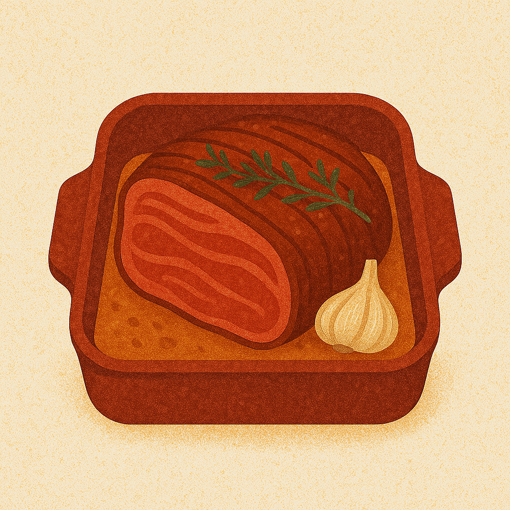

# Markdown — Images

## Local image

---

## URL image

---

## Image with title

---

## HTML version (for resizing)

---

## Notes
- Local images use relative paths.
- URL images load from the internet.
- HTML tags work in GitHub Markdown for advanced formatting.